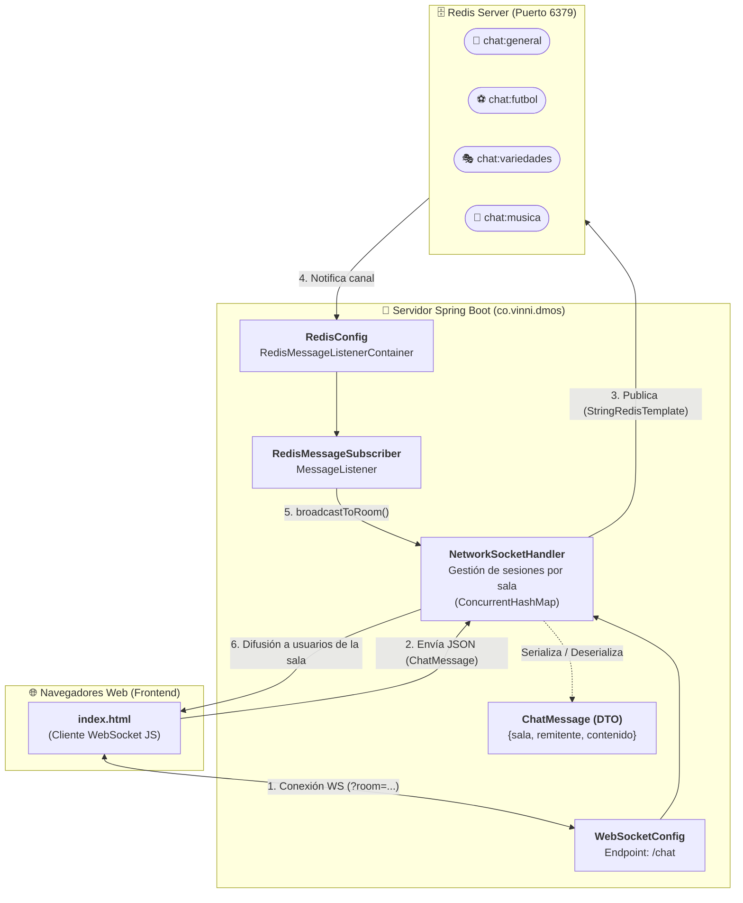

Diagrama de la solución 

```mermaid
flowchart TB
    subgraph Clientes ["🌐 Navegadores Web (Frontend)"]
        UI["<b>index.html</b><br/>(Cliente WebSocket JS)"]
    end

    subgraph SpringBoot ["🍃 Servidor Spring Boot (co.vinni.dmos)"]
        WSConfig["<b>WebSocketConfig</b><br/>Endpoint: /chat"]
        Handler["<b>NetworkSocketHandler</b><br/>Gestión de sesiones por sala<br/>(ConcurrentHashMap)"]
        RedisConf["<b>RedisConfig</b><br/>RedisMessageListenerContainer"]
        Subscriber["<b>RedisMessageSubscriber</b><br/>MessageListener"]
        DTO["<b>ChatMessage (DTO)</b><br/>{sala, remitente, contenido}"]
    end

    subgraph RedisServer ["🗄️ Redis Server (Puerto 6379)"]
        direction LR
        T1(["📢 chat:general"])
        T2(["⚽ chat:futbol"])
        T3(["🎭 chat:variedades"])
        T4(["🎵 chat:musica"])
    end

    %% Flujo de conexión y envío
    UI <-->|"1. Conexión WS (?room=...)"| WSConfig
    WSConfig --> Handler
    UI -->|"2. Envía JSON (ChatMessage)"| Handler
    Handler -.->|"Serializa / Deserializa"| DTO
    Handler -->|"3. Publica (StringRedisTemplate)"| RedisServer

    %% Flujo de suscripción y difusión
    RedisServer -->|"4. Notifica canal"| RedisConf
    RedisConf --> Subscriber
    Subscriber -->|"5. broadcastToRoom()"| Handler
    Handler -->|"6. Difusión a usuarios de la sala"| UI
```
